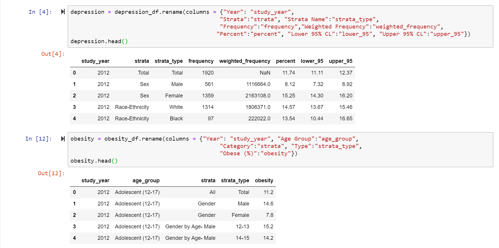
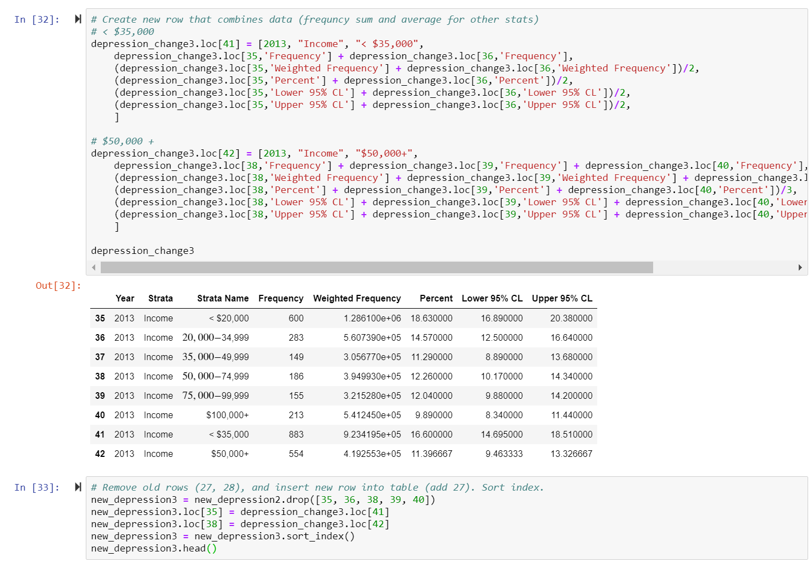
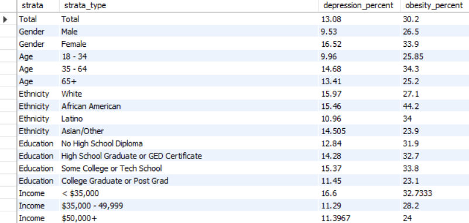


# ETL Project – Obesity and Depression in California

<strong>Team</strong>
 

<ol>
<li>Orlando Carpio – Team Leader</li>
<li>Mery Jimenez</li>
<li>Yuan Chai</li>
<li>Nagaraj (Raj)</li>
</ol>

## Project Details

#### Introduction

The goal of this project is to find, transform, and load data on obesity demographics and data on depression demographics into a database in order to compare them. There have been cases where some people who are depressed may overeat to attempt to make themselves feel better, and some people who are obese may feel terrible about their appearance and become depressed. Thus, there may be a correlation between obesity and depression. Two data sources which have data on depression and obesity in California were chosen for transformation and analysis.

#### ETL Process

Extract

<ol>
    <li>Obtain and read files associated with our topic from different sources. For this project, we used two CSV Files obtained from two different sources in the data.world website.
 

Sources

<ul>
<li>https://data.world/health/california-obesity-2012-2013</li>
<li>https://data.world/chhs/5a281abf-1730-43b0-b17b-ac6a35db5760</li>    
</ul>
</li>
 
<li>Open Jupyter notebook, import pandas and import create_engine from sqlalchemy.</li>

<li>Read the csv files in Jupyter Notebook using encoding latin1 and create a Pandas DataFrame for each data set.</li>
</ol>

<strong>Transform</strong>

 

<ol>
    <li>Rename the columns to make them lowercase, remove spaces, and remove character symbols in order to make the column headers fit the SQL table style.   
After looking at the data from both data sets, we noticed that some strata types in one data set did not match the strata types in the other data set.
       

<strong>Examples:</strong>

<ul>
    <li>Age groups were not same between the two data sets.</li>
    <li>Income and education were grouped differently. </li>
    <li>Race/Ethnicity combined two strata types in one data set but kept them separate in the other data set.</li>
</ul>

In addition, the depression DataFrame had data from 2012-2017 for age 18+, but the obesity DataFrame had data from 2012-2013, and only had data for age18+ for the year 2013. Therefore, the two DataFrames needed to be transformed to make the data sets comparable.

 
</li>  
<li>Filter both DataFrames by the year 2013.</li> 

<li>Filter the obesity DataFrame by the age group Adult 18+.</li> 

<li>Combine the obesity DataFrame strata types 18 - 24, 25 - 34, 35 - 50, and 51 - 64 to create the strata types 18 - 34 and 35 - 64. Average the obesity percentages when combining the strata types. Remove the old strata type rows and add the new strata type rows. Sort index.</li> 

<li>Combine the obesity DataFrame strata types: Less than $15,000, $15,000 - 24,999, and $25,000 - 34,999 to create the strata type < $35,000. Average the obesity percentages when combining the strata types. Remove the old strata type rows and add the new strata type rows. Sort index.</li> 

<li>Combine the depression DataFrame strata types Asian/Pacific Islander and Other to create the strata type Asian/Other. Sum the frequency and average the weight frequency, percent, lower 95% and upper 95% when combining the strata types. Remove the old strata type rows and add the new strata type rows. Sort index.</li> 

<li>Combine the depression DataFrame strata types 35 to 44, 45 to 54, and 55 to 64 to create the strata type 35 to 64. Sum the frequency and average the weight frequency, percent, lower 95% and upper 95% when combining the strata types. Remove the old strata type rows and add the new strata type rows. Sort index.</li> 

<li>Combine the depression DataFrame strata types <$20,000, $20,000 - $34,999, $35,000 - $49,999, $50,000 - $74,999, $75,000 - $99,999, and $100,000+ to create the strata types <$35,000 and $50,000+. Sum the frequency and average the weight frequency, percent, lower 95% and upper 95% when combining the strata types. Remove the old strata type rows and add the new strata type rows. Sort index</li> 

<li>Rename the obesity DataFrame strata types for education and reset index.
<ul>
    <li>Less than High School => No High School Diploma</li>
    <li>High School Graduate => High School Graduate or GED Certificate</li>
    <li>Some College => Some College or Tech School</li>
    <li>College Graduate => College Graduate or Post Grad</li>
</ul>
</li> 

<li>Rename the depression DataFrame strata types for gender, income, age, and race/ethnicity, rename the depression DataFrame stratas for gender and ethnicity, and reset index. 

Stratas

<ul>
    <li>Sex => Gender</li>
    <li>Race-Ethnicity  => Ethnicity</li>
</ul>
 

Strata Types:

<ul>
    <li>Black => African American</li>
    <li>Asian/Pacific Islander => Asian/Other</li>
    <li>Hispanic => Latino</li>
    <li>35,00 - 49,999 => $35,000 - 49,999</li>
    <li>18 to 34 => 18 - 34</li>
    <li>35 to 64 => 35 - 64</li>
    <li>65+ years => 65+</li>
    <li>65+ years => 65+/li>
</ul>
</li>
</ol>   

<strong>Load</strong>

<ol>
<li>Connect to the MySQL database using create_engine.</li> 
<li>Confirm MySQL table names so the final modified DataFrames can be transferred to the correct tables.</li> 
<li>Transfer the final modified DataFrames to the appropriate tables in the MySQL database.</li> 

<strong>Analysis</strong>

<li>Join the tables in MySQL for analysis. MySQL was chosen because the data sets could be transformed to have matching strata types in order to create structured data.  Because structured data was being used, a relational database like MySQL was chosen instead of a non-relational database.</li>

</ol>

## SQL code to create the database and tables
create database obesity_depression_db;

use obesity_depression_db;

create table obesity(
	id INT AUTO_INCREMENT NOT NULL primary key,
	study_year int,
	age_group text,
	strata text,
	strata_type text,
	obesity float
);    

create table depression(
    id INT AUTO_INCREMENT NOT NULL primary key,
	study_year int,
	strata text,
	strata_type text,
	frequency int,
	weighted_frequency int,
	percent float,
	lower_95 float,
	upper_95 float
);
## SQL code to join the two tables in order to compare the two datasets
select d.strata, o.strata_type, d.percent as depression_percent, o.obesity as obesity_percent
from obesity as o
inner join depression as d
on d.strata_type = o.strata_type;

## SQL join results

## Conclusion

By strata type, the percentage of people with obesity appears to be around double the percentage of people with depression.
